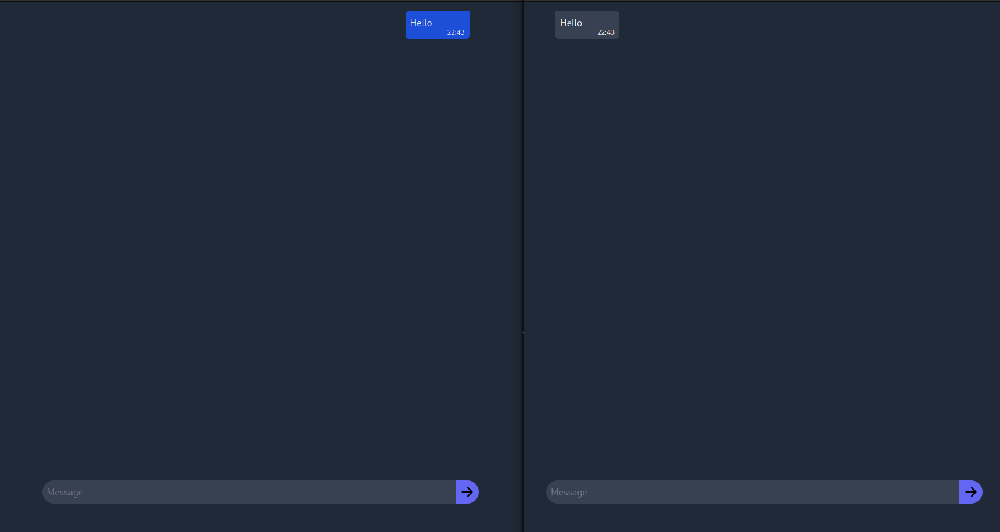

# chat-hotwire-go
This is a simple chat app which shows how to use Go with [Hotwire](https://hotwire.dev/).



- Messages from another user are received via [Turbo Streams](https://turbo.hotwire.dev/reference/streams) over a websocket connection.
- A [stimulus](https://stimulus.hotwire.dev/) controller is used to clear the message form.
- The application can work without JavaScript 

## Setup
You need to have [go](https://golang.org/dl/) and [npm](https://docs.npmjs.com/downloading-and-installing-node-js-and-npm) installed.

Then run:
```sh
go get -u github.com/cosmtrek/air
git clone https://github.com/lu4p/chat-hotwire-go.git
cd chat-hotwire-go
npm install
npm run dev
```

After the above just run `air`, to start the webapp with hot reloading.

**Note:** The generated `dist/main.css` file is rather large now at ~6MB, but don't worry this is only because every possible class of tailwind is included (there are many), once you build for production only ~4KB of CSS is left.

If you want to also rebuild the JS and CSS on change run `npm run watch` in a separate terminal session.

To build for production run `npm run prod` and then `go build`.

## This project uses:
- [html/template](https://pkg.go.dev/html/template), a html templating library included in the stdlib of Go
- [Echo](https://echo.labstack.com/), a Go web framework
- [Hotwire](https://hotwire.dev/) a new approach from Basecamp for writing modern web applications without much JavaScript
- [tailwindcss](https://tailwindcss.com/), makes HTML look nice
- [webpack](https://webpack.js.org/), for packing JS and CSS into single files, with minimization enabled, setup to extract CSS to a seperate file 
- [Air](https://github.com/cosmtrek/air), for hot reloading Go code and templates on change.
